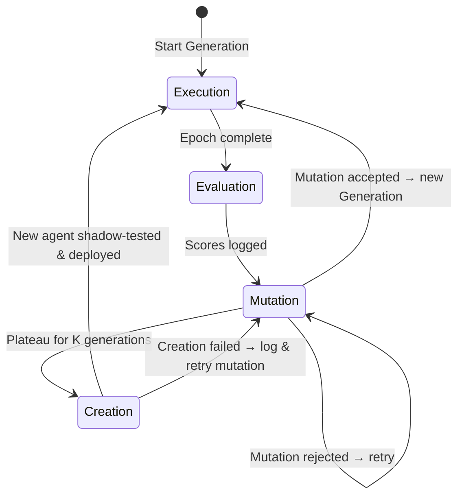

# System Architecture

The Self-Creating Framework is a generalized, multi-agent system architecture designed to explore automated arbitration, negotiation, and strategy evolution. It simulates high-stakes environments where diverse agents must navigate conflicting goals, external pressures, and incomplete information to reach a resolution.

## 1. High-Level Overview

The framework operates on a turn-based Execution Loop managed by a central Environment. It utilizes several specialized agent archetypes to simulate a rich, chaotic, and realistic negotiation or conflict-resolution space.

### Agent Taxonomy

#### A. The Environment (The Runtime)

The `Environment` is not an LLM itself, but the deterministic state machine that orchestrates everything else.

* **Responsibilities**: Manages turn order, tracks the formal `State Object` (the evolving agreement or situation), monitors timeouts and walk-aways, and calculates environmental variables (e.g., global tension levels).

#### B. Primary Actors (The Negotiators/Combatants)

These are the primary entities engaged in the simulation (e.g., $N$ competing interests).

* **Characteristics**: They are driven by specific system prompts enforcing unique constraints and goals. They operate on a defined `Strategy Prompt`, produce public dialogue, maintain an internal monologue (Chain of Thought), and formally propose modifications to the global `State Object`.

#### C. Observer/Disruptor Agents (The Chaos Factor)

These agents do not directly negotiate but react to and influence the environment, adding realism and testing the  of the Primary Actors.

* **Stochastic Shocks**: Agents (like a simulated News Media) that observe the transcript and periodically generate sensationalized or synthesized information, injected back into the environment to disrupt talks.
* **Emotional/Disruptors**: Agents that observe the transcript/disruptors and output an internal metric (e.g., anxiety level 1-10) which the Environment uses to update global tension variables.

#### D. Meta Agents (The Evolution Engine)

These agents govern the simulation's ability to self-improve and self-create. They operate outside the standard execution loop.

* **The Judge (Critic)**: Evaluates the final outcome of a simulation against the *secret* initial goals of the Actors, assigning objective reward scores.
* **The Capitalizing Agent (Interjector)**: Eavesdrops on the internal monologues of the Actors during a turn. It calculates mathematical overlap in hidden goals and whispers strategic hints to the current speaker.
* **The Mutator (Generator)**: Analyzes failed episodes, queries long-term memory, and generates new `Strategy Prompts` to improve the Actors' performance over subsequent generations.
* **The Provisioner**: Analyzes prolonged systemic deadlocks and dynamically architects entirely new agents (e.g., a "Mediator Agent") to inject into the environment.
* **The Explorer (Possibility Researcher)**: Scans the external landscape of available "ingredients" (technologies, APIs, models, research) and synthesizes convergence hypotheses — products or capabilities that *could* be built today but have not yet been combined. Its hypotheses are naturally stress-tested by the existing debate pipeline. See `explorer_agent.md`.

## 2. The Execution Loop

A single "Tick" of the environment follows a strict sequence to ensure deterministic execution and proper context management:

1. **Pre-Turn Check**: The Environment verifies if `max_turns` is reached or if an Actor has triggered a `abort_episode` condition. If yes, it halts the loop and triggers the Evaluation phase (The Judge).
2. **Capitalizing Interjection**: Before the primary Actor speaks, the Capitalizer observes the public transcript and recent internal monologues. It calculates strategic overlaps and formulates a private hint.
3. **Primary Turn Initialized**: The `current_speaker` (e.g., Agent A) receives the formalized `EnvironmentState` (including the transcript, the current draft state object, global tension levels, and the Capitalizer's hint).
4. **Primary Action Generated**: The Actor generates its structured JSON output (Dialogue, Internal Monologue, State Updates, Final Offer status).
5. **State Update**: The Environment appends the dialogue to the transcript and patches the global `State Object` based on the Actor's proposed modifications.
6. **Disruptor Check (Tension)**: The Disruptor receives the updated state, outputting a new anxiety level. The Environment updates the global tension variable.
7. **Disruptor Check (Information)**: Every *N* turns, Information Agents read the transcript, generate synthesized reports, and the Environment appends them to the public transcript.
8. **Turn Advance**: The `current_speaker` variable switches to the next Actor in the defined `turnOrder`.
9. **Context Maintenance**: The Environment prunes/summarizes the current context to maintain optimal token counts. The loop repeats.

### Execution Loop Sequence Diagram

```mermaid
sequenceDiagram
    participant Env as Environment
    participant Cap as Capitalizer
    participant Actor as Current Speaker
    participant Tension as Disruptor
    participant Info as Info Disruptor

    Env->>Env: Pre-Turn Check (max_turns / abort_episode?)
    Env->>Cap: Request interjection
    Cap-->>Env: CapitalizerHint (strategic_hint)
    Env->>Actor: EnvironmentState + hint
    Actor-->>Env: ActionProposal (JSON)
    Env->>Env: Zod validate → retry loop (max 3)
    Env->>Env: Apply state_mutations + check permissions
    Env->>Tension: Updated state
    Tension-->>Env: new_tension_level
    alt Every N turns
        Env->>Info: Transcript snapshot
        Info-->>Env: DisruptorReport (headline)
    end
    Env->>Env: Advance turn → switch speaker
```

### Framework Lifecycle State Diagram



## 3. Formal Terminology

These terms are used precisely throughout all documentation. They are defined here as the single source of truth.

* **Episode**: A single complete simulation run, from the initial `State Object` to a terminal condition (`abort_episode`, `propose_resolution` agreement, or `max_turns` timeout). An episode produces one Judge score per Actor.
* **Epoch**: A batch of $N$ episodes (e.g., $N = 10$) run with the same agent configurations. The Mutator analyzes the aggregate results of an epoch to generate mutations.
* **Generation**: A versioned snapshot of all active agent configurations (System Prompts + Hyperparameters). When the Mutator commits a new strategy, the generation number increments. The framework tracks lineage across generations.
* **Shadow Trial**: An isolated epoch run in the Arena using a *candidate* mutation against the frozen baseline of all other agents. Shadow trials never affect production agent state.

## 4. The Provisioner's Integration into the Execution Loop

When the Provisioner Meta-Agent is triggered (see `self_creation_mechanics.md` for trigger conditions), it outputs a complete agent specification. The Environment integrates the new agent as follows:

1. **Schema Validation**: The `EnvironmentManager` parses the Provisioner's output against the `NewAgentProvisioning` schema. If invalid, the creation is rejected and logged.
2. **Turn Sequence Modification**: Based on the new agent's `turn_injection_logic` (e.g., `"speak_every_3_turns"`), the Environment dynamically extends its internal turn-order array. Example: `[A, B]` becomes `[A, B, C]` or `[A, B, C, A, B, C]`.
3. **Permissions Binding**: The new agent's `capabilities` array is cross-referenced against a permissions whitelist. The agent can only modify `State Object` fields it has been explicitly authorized to touch.
4. **Shadow Testing**: The new agent configuration enters the Arena for shadow trials before being committed to the main simulation. It must pass the same A/B acceptance criteria as prompt mutations (see `evaluation_and_math.md`).

## 5. High-Level Lifecycle

The complete framework lifecycle flows through four distinct phases:

1. **Execution Phase** → Run an Epoch of Episodes using current generation agents.
2. **Evaluation Phase** → The Judge scores each episode. Results are logged to SQLite and Vector Memory.
3. **Mutation Phase** → The Mutator analyzes the worst-performing episodes, generates candidate strategies, and tests them in Shadow Trials. Successful mutations increment the Generation.
4. **Creation Phase** (conditional) → If performance has plateaued for $K$ consecutive generations (see `self_creation_mechanics.md`), the Provisioner designs and provisions a new agent. The new agent is shadow-tested before integration.

9. **Context Maintenance**: Every *N* turns, the Environment triggers the `SummarizationAgent` to prune the transcript and state object (see `context_management_and_summarization.md`). This prevents reasoning degradation due to context window pressure.

Phases 1–3 repeat indefinitely. Phase 4 triggers only when the Mutation Phase can no longer yield improvement.
